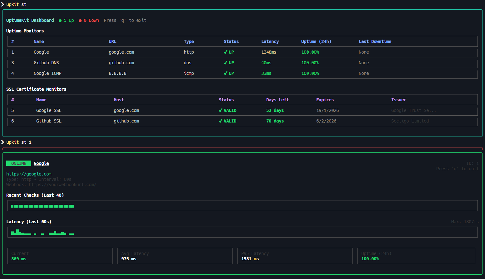

<div align="center">

# UptimeKit 🖳

**Production-ready uptime monitoring from your terminal**

[](https://www.npmjs.com/package/uptimekit)
[](https://www.npmjs.com/package/uptimekit)
[](https://opensource.org/licenses/MIT)

</div>


---

## Installation

```bash
npm install -g uptimekit
```

## Quick Start

```bash
# Start the monitoring daemon
upkit start

# Add a monitor
upkit add https://google.com -t http -i 30 -n "Google"

# Add a monitor to a group
upkit add https://api.dev.com -t http -i 30 -n "Dev API" -g dev

# View dashboard
upkit status

# View detailed stats
upkit status 1

# View only monitors in a specific group
upkit status -g dev
```

## Features

- **Background Daemon** - Continuous monitoring without keeping terminal open
- **Live Dashboard** - Real-time TUI with status, latency, and uptime metrics
- **Multi-Protocol** - HTTP/HTTPS, ICMP Ping, DNS, and SSL Certificate monitoring
- **SSL Certificate Monitoring** - Track certificate expiration with alerts
- **Monitor Grouping** - Organize monitors as you like
- **Desktop Notifications** - Get notified when monitors go down or certificates expire
- **Webhook Alerts** - Send status updates to custom webhook URLs
- **Rich Metrics** - Latency sparklines, P95, status history timeline
- **Lightweight** - Minimal resource usage with SQLite storage

## Commands

### Daemon
```bash
uptimekit start          # Start monitoring daemon
upkit start              # alias

uptimekit stop           # Stop daemon
upkit stop               # alias
```

### Monitors
```bash
uptimekit add <url> -t <type> -i <interval> -n <name>
upkit add <url> -t <type> -i <interval> -n <name>    # alias

uptimekit status         # View all monitors
upkit st                 # alias

uptimekit status <id>    # View monitor details
upkit st <id>            # alias

uptimekit edit <id>      # Edit monitor
upkit edit <id>          # alias

uptimekit delete <id>    # Delete monitor
upkit del <id>           # alias

uptimekit clear          # Clear all monitors
upkit clr                # alias

uptimekit reset          # Reset the database
upkit reset              # alias
```

### Groups
```bash
uptimekit group          # List all groups
upkit grp                # alias

uptimekit group list     # List all groups with monitor counts
upkit grp list           # alias

uptimekit group rename <old> <new>  # Rename a group
upkit grp rename <old> <new>        # alias

uptimekit group delete <name>              # Delete group (ungroups monitors)
upkit grp delete <name> --with-monitors    # Delete group and its monitors
```

### Notifications
```bash
uptimekit notif enable   # Enable desktop notifications
upkit notif enable       # alias

uptimekit notif disable  # Disable desktop notifications
upkit notif disable      # alias

uptimekit notif status   # Check notification status
upkit notif status       # alias
```

### Options for `add` and `edit`

- `-t, --type` - Monitor type: `http`, `icmp`, `dns`, `ssl`
- `-i, --interval` - Check interval in seconds (default: 60)
- `-n, --name` - Custom name
- `-u, --url` - URL/Host (for `edit` command)
- `-w, --webhook` - Webhook URL to receive status updates
- `-g, --group` - Group name (use `none` to remove from group)

### Options for `status`

- `-g, --group` - Filter monitors by group name

## Monitor Types

**HTTP/HTTPS** - Website availability
```bash
upkit add https://example.com -t http -i 30
```

**ICMP Ping** - Server reachability
```bash
upkit add 8.8.8.8 -t icmp -i 10
```

**DNS** - Domain resolution
```bash
upkit add google.com -t dns -i 60
```

**SSL Certificate** - Certificate expiration monitoring
```bash
upkit add example.com -t ssl -i 3600 -n "Example SSL"
```

## Monitor Grouping

Organize your monitors into groups for better management. Groups are useful for separating monitors by environment (dev, staging, production) or by project.

### Adding Monitors to Groups

```bash
# Add monitor to a group
upkit add https://api.dev.com -t http -i 30 -n "Dev API" -g dev
upkit add https://api.staging.com -t http -i 30 -n "Staging API" -g staging
upkit add https://api.prod.com -t http -i 30 -n "Prod API" -g production
```

### Filtering by Group

```bash
# View only monitors in a specific group
upkit status -g dev
upkit status -g production
```

### Managing Groups

```bash
# List all groups with monitor counts
upkit group

# Rename a group
upkit group rename dev development

# Delete a group (monitors become ungrouped)
upkit group delete old-group

# Delete a group AND all its monitors
upkit group delete test-group --with-monitors
```

### Editing Monitor Groups

```bash
# Change a monitor's group
upkit edit my-monitor -g production

# Remove a monitor from its group
upkit edit my-monitor -g none
```

## Webhooks

Configure webhook URLs to receive HTTP POST notifications when monitors change status (UP/DOWN).

### Webhook Payload

When a monitor's status changes, UptimeKit sends a POST request with the following JSON payload:

```json
{
  "event": "monitor_up" ,
  "monitor": {
    "name": "My Website",
    "url": "https://example.com",
    "status": "up",
    "time": "2025-11-27T15:40:59.403Z"
  }
}
```

The `event` field will be either `monitor_up` or `monitor_down`.

### Usage

```bash
# Add monitor with webhook
upkit add https://mysite.com -t http -n "My Site" -w https://yourwebhookurl.com/

# Add webhook to existing monitor
upkit edit 1 -w https://yourwebhookurl.com/

# Remove webhook
upkit edit 1 -w none
```

## Examples

```bash
# Monitor a website every 30 seconds
upkit add https://mysite.com -t http -i 30 -n "My Website"

# Monitor with webhook notifications
upkit add https://mysite.com -t http -i 30 -n "My Website" -w https://yourwebhookurl.com/

# Ping Google DNS every 10 seconds
upkit add 8.8.8.8 -t icmp -i 10 -n "Google DNS"

# Check DNS resolution every minute
upkit add github.com -t dns -i 60 -n "GitHub DNS"

# Monitor SSL certificate expiration (check every hour)
upkit add mysite.com -t ssl -i 3600 -n "My Site SSL"

# Add monitors to groups
upkit add https://api.dev.com -t http -i 30 -n "Dev API" -g dev
upkit add https://api.prod.com -t http -i 30 -n "Prod API" -g production

# View all monitors
upkit st

# View only production monitors
upkit st -g production

# List all groups
upkit group

# Move monitor to different group
upkit edit 1 -g staging

# View detailed stats for monitor #1
upkit st 1

# Delete monitor #1
upkit del 1

# Edit monitor #1 (interactive)
upkit edit 1

# Edit monitor #1 (flags)
upkit edit 1 -i 120 -n "Updated Name"
```

## Dashboard

The dashboard shows:

- Monitor status (UP/DOWN)
- Current latency
- 24-hour uptime percentage
- Last downtime
- Group name (if assigned)

Monitors are organized by group, with each group displayed in its own section. SSL monitors are displayed in a separate table showing:

- Certificate validity status
- Days remaining until expiration
- Expiry date
- Certificate issuer

## Detail View

The detail view includes:

- Status timeline (last 40 checks)
- Latency sparkline (last 60 seconds)
- Current, average, and P95 latency
- 24-hour uptime percentage
- Group name (if assigned)
- Configured webhook URL (if set)

For SSL monitors, the detail view shows:

- Certificate subject and issuer
- Valid from/to dates
- Days remaining until expiration
- Serial number and fingerprint


## Requirements

- Node.js 16+
- Linux, macOS, or Windows


## Documentation

Full documentation: [GitHub Repository](https://github.com/abhixdd/UptimeKit-CLI)

## Contributing

Contributions are welcome! Please read our [Contributing Guidelines](CONTRIBUTING.md) for details on how to submit pull requests, report issues, and contribute to the project.

## License

UptimeKit is made available under the terms of the [MIT License](https://opensource.org/licenses/MIT).

Copyright (c) 2025 [abhixdd](https://github.com/abhixdd)

---


⭐ [Star on GitHub](https://github.com/abhixdd/UptimeKit-CLI) • 🐛 [Report Bug](https://github.com/abhixdd/UptimeKit-CLI/issues) • 💡 [Request Feature](https://github.com/abhixdd/UptimeKit-CLI/issues)


